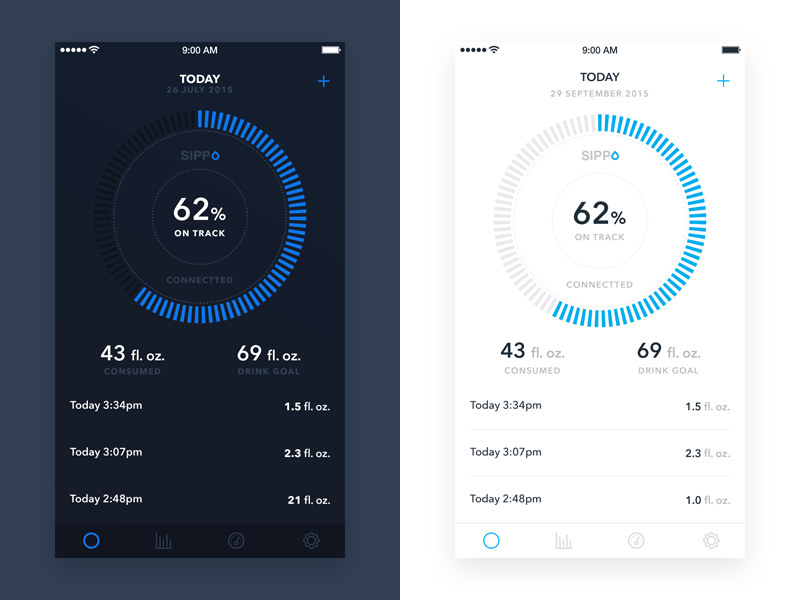

##### EJERCICIO-2

## useDarkMode

### OBJETIVO

Como parte es este prework queremos implementar un hook propio (custom hook) para  implementar dark mode.
en este episodio queremos activar dark mode. 
esto es, invertir los constrastes de la pagina para poder disfrutar de uan experiencia mas facil de leer por largo tiempo.

Ejemplos

#### REQUISITOS

* Ejecutar `npm install` o `yarn` en la raiz de este proyecto
* Ejecutar `npm start` o `yarn start` en la raiz de este proyecto
* Navegar a la pagina `http://localhost:8080/refs/video`

#### Proposito

