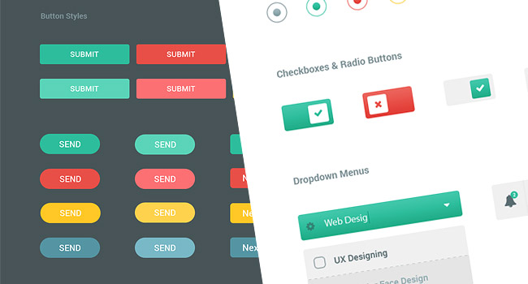
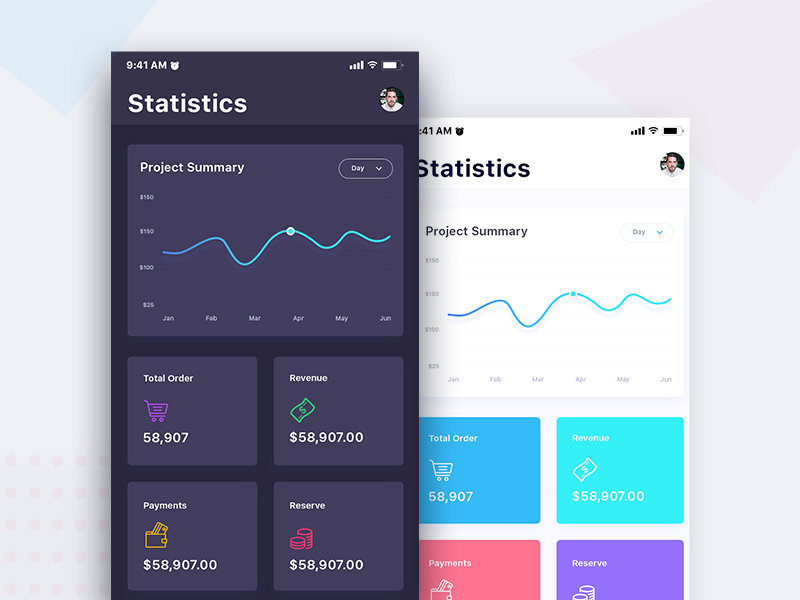

##### EJERCICIO-2

## useDarkMode

### OBJETIVO

Como parte es este prework queremos implementar un hook propio (custom hook) para  implementar dark mode.
en este episodio queremos activar dark mode. 
esto es, invertir los constrastes de la pagina para poder disfrutar de uan experiencia mas facil de leer por largo tiempo.

Ejemplos

#### REQUISITOS

* Ejecutar `npm install` o `yarn` en la raiz de este proyecto
* Ejecutar `npm start` o `yarn start` en la raiz de este proyecto
* Navegar a la pagina `http://localhost:8080/refs/video`

#### DESARROLLO

En la parte anterior , desribimos como crear tu propio hook.
en este ejercicio te proveemos con  2 hooks custom bastante versatiles.

- `useMedia` permite usar js para verificar si cumplimos las condiciones de cualquier media queria. regresa un booleano
- `useLocalStorage`  es idéntico a `useState` excepto por el hecho que persiste tus datos a localStorage. Esto permite que la segunda vez que abras la aplicacion ya tengas cierta configuración guardada.
Esto es importante por que estamos manejando un state que funciona de configuracion

Esto es lo que intentamos construir

