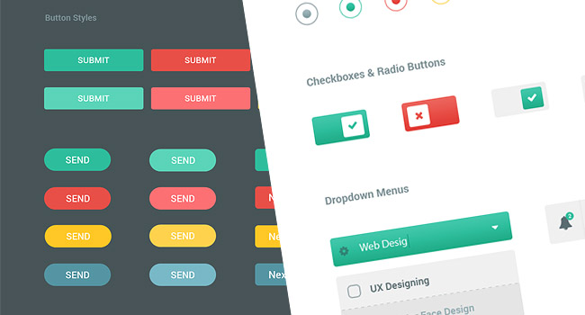
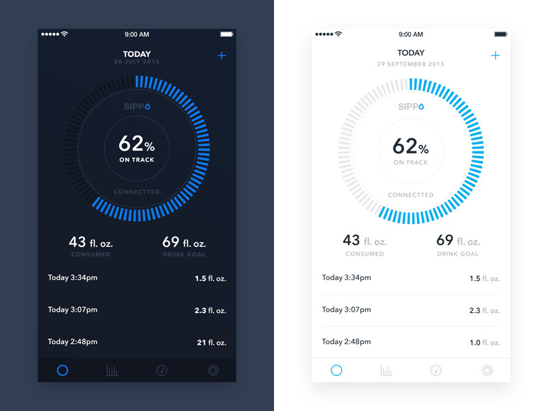
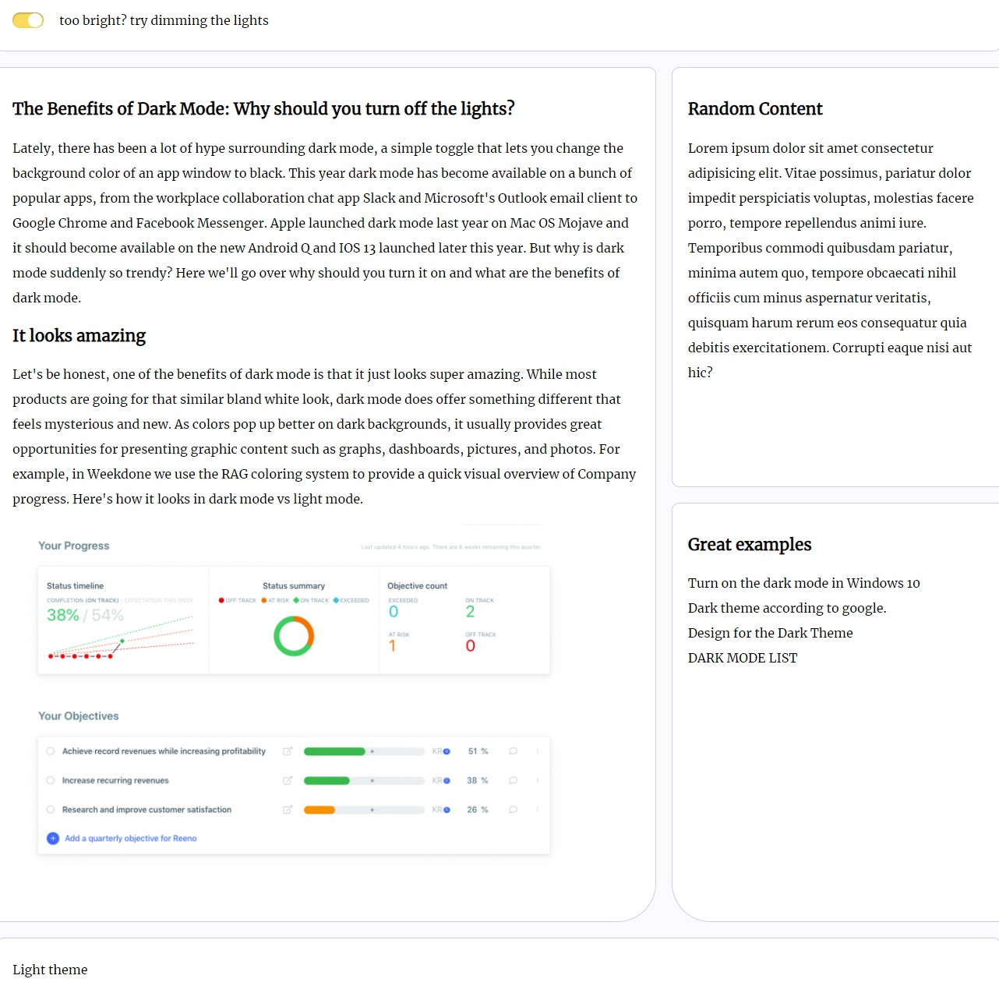
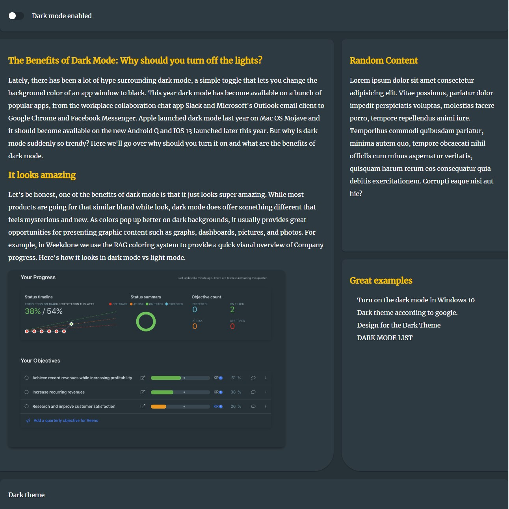

##### EJERCICIO-2



## useDarkMode

### OBJETIVO

Como parte es este prework queremos implementar un hook propio (custom hook) para  implementar dark mode.
en este episodio queremos activar dark mode. 
esto es, invertir los constrastes de la pagina para poder disfrutar de uan experiencia mas facil de leer por largo tiempo.

<details>

<summary >Ejemplos</summary>




</details >


#### REQUISITOS

* Ejecutar `npm install` o `yarn` en la raiz de este proyecto
* Ejecutar `npm start` o `yarn start` en la raiz de este proyecto
* Navegar a la pagina `http://localhost:8080/refs/video`

#### DESARROLLO

En la parte anterior , desribimos como crear tu propio hook.
en este ejercicio te proveemos con  2 hooks custom bastante versatiles.

- `useMedia` permite usar js para verificar si cumplimos las condiciones de cualquier media queria. regresa un booleano
- `useLocalStorage`  es idéntico a `useState` excepto por el hecho que persiste tus datos a localStorage. necesita saber el nombre de la variable a guardar/buscar. Esto permite que la segunda vez que abras la aplicacion ya tengas cierta configuración guardada.
Esto es importante por que estamos manejando un state que funciona de configuracion


Esto es lo que intentamos construir

Una app que nos permita cambiar de tema de light a dark

- Primero revisará si tenemos una preferencia local guardada en el browser para usar eso
- Luego verificara cual es el setting default del sistema operativo 
- si cualquiera de estas dos opciones indica que se requiera Dark Mode se procederá a modificar el dom añadir una clase al body
-  se cargara una css diferente para cada estado, tanto light como para dark.
 - solo cargará la porcion correspondiente a colores.


Primero creamos una funcion fuera la clase( puede ser un archivo externo) llamada `useDarkMode`
esta es la estructura de la funcion que necesitamos


```js

function useDarkMode() {

 // Buscamos en local storage si tenemos un configuracion guardada en una visita anterior  

// Buscamos si hay una configuracion propia del sistema operativo

//  Damos prioridad a el estado local , si no existe usamos la preferencia del sistema operativo para decidir si se activa  o no el dark mode

// Generamos los cambios en el dom para agregar la clase _solo si_ se requiere dark mode 

// Regresamos una funcion para activar  consultar el estado de darkmode
}

```

Empezemos.

1. Usamos `useLocalStorage` con la llave de `dark-mode-enabled` y destructuramos su valor de retorno en `enabledState` y `setEnabledState`

```js
function useDarkMode() {
  const [enabledState, setEnabledState] = useLocalStorage('dark-mode-enabled')
}
```

2. creamos una funcion aparte. fuera de la clase  y de esta funcion  llamada `usePrefersDarkMode` que retorne el valor de `useMedia` este hook toma 3 valores, el array de media queries a checar, el valor a regresar si lo encuentra  y el valor inicial

```js
function usePrefersDarkMode() {
  return useMedia(['(prefers-color-scheme: dark)'], [true], false)
}
```
[https://developer.mozilla.org/en-US/docs/Web/CSS/@media/prefers-color-scheme](prefers-color-scheme)

 de vuelta a nuestra funcion `useDarkMode`

3. usamos `usePrefersDarkMode` y asignamos el retorno  a una variable llamada  `prefersDarkMode` 

```js
  const prefersDarkMode = usePrefersDarkMode()
```

4. ahora tenemos que obtener el valor final de `dark-mode` . como comentamso anteriormente. damos prioridad a la configuracion local del browser.
   
     `const enabled = typeof enabledState !== 'undefined' ? enabledState : prefersDarkMode` 

    esta linea esta comprobando que la variable enabledState este definida ( recuerda que esa variable viene de `useLocalStorage` ) y asigna su valor. en caso contraro usa el valor del sistema operativo.

5. llego el momento de generar el cambio al dom. para esto usamos `useEffect`
      si esta `enabled` agregamos la clase `dark-mode` si no , la quitamos.
      este hook solo debe correr cuando cambia la varibale enabled. asi que lo pasamos como dependencia al hook 

```js

  useEffect(() => {
    const className = 'dark-mode'
    const element = window.document.body
    if (enabled) {
      element.classList.add(className)
    } else {
      element.classList.remove(className)
    }
  }, [enabled]) 

  ```

  6. por ultimo regresamos un array de dos elementos. la variable enabled y la funcion para cambiarla. recuerdamos que estas dos vienen de `useLocalStorage`

`return [enabled, setEnabledState]`


 ```js

function useDarkMode() {
   // Buscamos en local storage si tenemos un configuracion guardada en una visita anterior  
  const [enabledState, setEnabledState] = useLocalStorage('dark-mode-enabled')

 // Buscamos si hay una configuracion propia del sistema operativo
  const prefersDarkMode = usePrefersDarkMode()

//  Damos prioridad a el estado local , si no existe usamos la preferencia del sistema operativo para decidir si se activa  o no el dark mode
  const enabled = typeof enabledState !== 'undefined' ? enabledState : prefersDarkMode

// Generamos los cambios en el dom para agregar la clase _solo si_ se requiere dark mode 
  useEffect(() => {
    const className = 'dark-mode'
    const element = window.document.body
    if (enabled) {
      element.classList.add(className)
    } else {
      element.classList.remove(className)
    }
  }, [enabled]) 

// Regresamos una an array con : un booleano y uan funcino para activar dark mode
  return [enabled, setEnabledState]
}
 ```


 Regresando a nuestra funcion principal con el JSX , 

 llamamos useDarkMode() en la primer linea y extraemos `darkMode` y `setDarkmode` estas corresponden internamente a  `enabled` y `setEnabledState`


 ```js
export default function App() {
  const [darkMode, setDarkMode] = useDarkMode()

  return (
    <div className="hooks2-darkMode">
      <header>
      . . . 
 ```

 Importamos `Toggle` y lo ponemso en el header en lugar del texto inicial , luego le pasamos el valor de darkmode y la funcion para actualizarla
 tambien creamos un span con texto condicional a dark mode.

 ```js
export default function App() {
  const [darkMode, setDarkMode] = useDarkMode()

  return (
    <div className="hooks2-darkMode">
      <header>
        <Toggle darkMode={darkMode} setDarkMode={setDarkMode} />
        <span>
          {darkMode
            ? 'Dark mode enabled '
            : 'too bright? try dimming the lights'}
        </span>
      </header>
      . . .
 ```

Queremos que la imagen cambie entre dos versiones diferentes de la imagen en base a darkmode

por lo que cambia de  ` ` a ` ` claro está, tenemos que importar lightUi al principio del archivo con  `import lightUI from './my-ui-light.png'`

en este punto solo estamos puliendo .

nuevo footer : 

```JSX
<footer> {!darkMode ? 'Light' : 'Dark'} theme</footer>
```

Ahora nuestro componente deberia animar una transición de tonos de oscuro a claro cuando escojamos dark


#### Resultados

<details>

<summary >Light </summary>




</details >


<details>

<summary >Dark</summary>





</details >


#### Conclusiones

Notarás la gran cantidad de codigo adicional en este ejercicio. empezando por el sass adicional. 
en style.scss  importamos `light_theme.scss` en el componente base y luego importamos `dark_theme.scss`  si el elemento body tiene la clase `dark-mode` agregada

```
//styles.scss
....
  }
  @import 'light_theme';
  h2 {
    font-size: 1.3em;
  }
}

body.dark-mode .hooks2-darkMode {
  @import 'dark_theme';
}
```

separar el scss en pequeños modulos nos permite separar los estilos del tema de cualquier otro estilo.
te invitamos a explorar mas a fondo el funcionamiento de usemedia y localStorage pra entender como el usar hooks nos permitio abstraer  la complejidad adicional